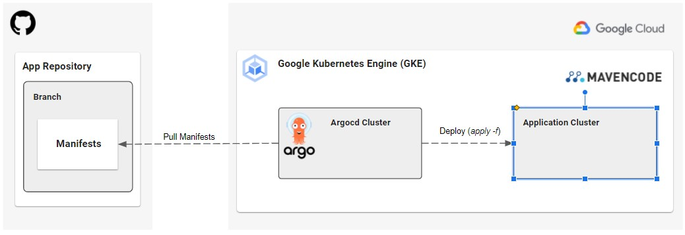

## **ArgoCD**

You can use `argocd` to deploy applications on Kubernetes clusters and automate Continuous Deployment (CD). `Argocd` is a tool for automating the procedures of deploying applications.  

The argocd process is as follows:

1. Runs in a Kubernetes cluster
2. Pulls manifests from a remote repository (each 3 minutes or triggered with webhook)
3. Compares pulled manifests and current state of the destination cluster
4. Applies new manifests to the cluster



## **Argo Installation**

In this section we describe the steps to install the argocd manually on the GKE cluster. However, we configured a git action to automatically install the argocd on our cluster.

Visit the link below to view the configuration.  
[**ArgoCD installation via Git Actions**](./documents/argo-doc.md)

## 1. Create Cluster on GKE

- Install gcloud CLI (command-line interface) on local machine
- Create google project
- Activate the google project
- Enable Kubernetes Engine API on Google account

Then, follow these steps:

```
gcloud init
```

Get projects list:

```
gcloud projects list --sort-by=projectId
```

Set default project:

```
gcloud config set project <PROJECT_ID>
```

Create a cluster on GCloud

```
gcloud container clusters create <CLUSTER_NAME> --num-nodes=1
```

I used `mavencode-cluster` as cluster name. You will see such result:

```
NAME               LOCATION    MASTER_VERSION   MASTER_IP     MACHINE_TYPE  NODE_VERSION     NUM_NODES  STATUS
mavencode-cluster  us-east1-b  1.21.5-gke.1302  35.227.34.39  e2-medium     1.21.5-gke.1302  1          RUNNING
```

Then, configure the `kubectl` to access the created cluster on google.

```
gcloud container clusters get-credentials <CLUSTER_NAME>
```

The result is:

```
Fetching cluster endpoint and auth data.
kubeconfig entry generated for <CLUSTER_NAME>.
```

Now, the `kubectl` is pointing to the gke cluster.

## 2. Installing ArgoCD

To install ArgoCD on cluster, create a namespace on kubernetes.

```
kubectl create namespace argocd
```

The following downloads the latest ArgoCD and installs on the active cluster.

```
kubectl apply -n argocd -f https://raw.githubusercontent.com/argoproj/argo-cd/stable/manifests/install.yaml
```

**Tip:** It is better to download the install.yaml file and store it locally, then install using the local file. So, you will have full control on the installation. The install.yaml file is included in this repository.

## 3. Installing ArgoCD CLI

ArgoCD CLI helps interacting with ArgoCD. It makes it easier to call ArgoCD APIs.

```
brew install argocd
```

## 4. Access ArgoCD Server

By default, ArgoCD does not expose external IP. So, you can enable the access following the methods metioned in Argo documentation. [Argo Documentation](https://argo-cd.readthedocs.io/en/stable/getting_started/). In this guide, we use **Port Forwarding** and **LoadBalancer**.

```
kubectl patch svc argocd-server -n argocd -p '{"spec": {"type": "LoadBalancer"}}'
```

Then expose the IP Port of ArgoCD using the following command:

```
kubectl port-forward svc/argocd-server -n argocd 8080:443
```

You can verify if argo resources are up and running in the cluster using:

```
kubectl get all -n argocd
```

**Tip:** for the production environment we need to configure the Ingress. [Ingress Configuration](https://argo-cd.readthedocs.io/en/stable/operator-manual/ingress/)

## 5. Login to ArgoCD

Argo initializes its admin user with a random password. This passowrd can be accessed using the following command:

```
kubectl -n argocd get secret argocd-initial-admin-secret -o jsonpath="{.data.password}" | base64 -d; echo
```

Use username `admin` and the password to login:

```
argocd login localhost:8080
```

## 6. Register Cluster to ArgoCD (If Argo and Cluster are not local)

Get current kubernetes clusters:

```
kubectl config get-contexts -o name
```

Choose a cluster and register it to the ArgoCD:

```
argocd cluster add <cluster-name>
```

## 7. Create an App on the Argo

Now, we consider that there is a sample application on a git repository. We want to create an applicatino in the ArgoCD to sync the cluster with this application latest version. ArgoCD pulls the latest version and updates the cluster state.

```
argocd app create <application-name> \
--repo https://github.com/<repo-address> \
--revision <branch-name> \
--path <path-to-kustomization-manifests> \
--dest-server https://kubernetes.default.svc \
--dest-namespace default
```

- `dest-server` : should be the URL of the kubernetes cluster. If it is the local default kubernetes, use `https://kubernetes.default.svc`. Unless otherwise, use the valid path.

- `dest-namespace` : the application deploys on the cluster under this namespace. It is recommended to create a namespace for each application or environment.

## 8. Sync Cluster and Application

At this step, you configured an application on the ArgoCD. But, the cluster has not been updated yet. So, the initial status will be `OutOfSync`. You can see the application description and details using the following command:

```
argocd app get <application-name>
```

Run the following command to start the sync:

```
argocd app sync <application-name>
```